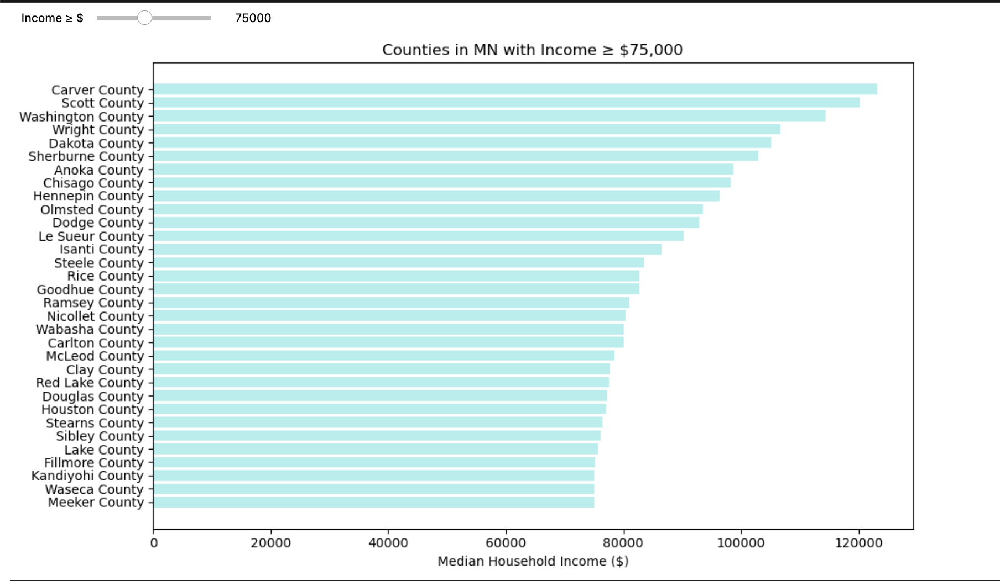
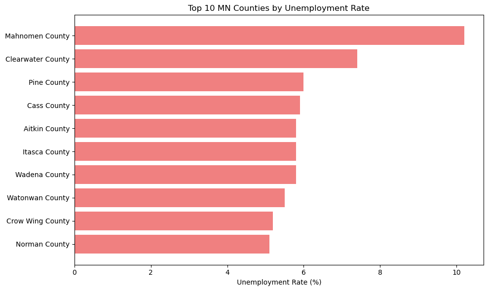
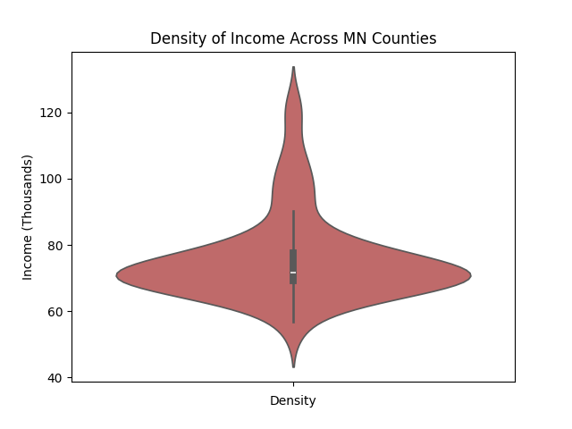
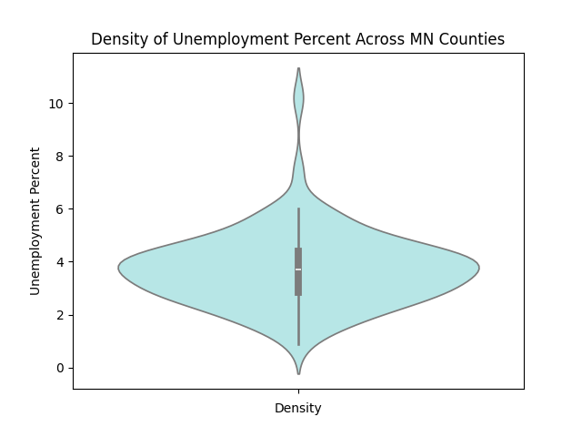

## Project Title

"Economic Trends in Minnesota: A County-Level Analysis of Income and Unemployment (2019–2023)"

## Introduction

This project aims to analyze and visualize key economic trends across Minnesota's counties from 2019 to 2023, with a specific focus on Median Household Income and Unemployment Rates. By examining these indicators, the project will highlight regional disparities and evolving economic conditions, offering valuable insights into the financial well-being and employment landscape throughout the state.

## Project Desciption

This project investigates economic trends across Minnesota's 87 counties between 2019 and 2023, using data on Median Household Income and Unemployment Rates. Through interactive visualizations and comparative analysis, the project will identify shifts in income distribution and employment patterns over time. Special attention will be given to highlighting regional disparities and economic resilience, offering a clearer understanding of how different communities within Minnesota have experienced and responded to recent economic changes. The goal is to provide policymakers, researchers, and the public with accessible insights into local economic conditions across the state.

## Process

The project leverages Python for data processing and visualization, primarily using libraries such as Pandas for data manipulation and Matplotlib for generating clear, insightful visualizations. A PostgreSQL database is employed to store and efficiently query the economic data, with SQLAlchemy or psycopg2 facilitating the connection between Python and the database. All analysis and visual exploration are conducted within a Jupyter Notebook environment, enabling interactive filtering, iterative development, and dynamic visualization.

## Analysis

### MN by Median Household Income
This chart shows Minnesota counties by median household income.

An interactive slider (via ipywidgets) lets users filter counties by income — set at $75K on the left, and $100K on the right to highlight top earners.

It helps visualize regional wealth patterns and compare counties to the U.S. average income of $78,538.

### Counties by Unemployment
Here are the top counties by unemployment:  
- **Mahnomen** – Highest jobless rate, lowest income; White Earth Nation reservation.  
- **Clearwater** – Rural, reservation area with limited job access.  
- **Pine** – Lower education, older commuters; median age 45.8.  
- **Cass** – Remote, economically challenged; includes Leech Lake Reservation.  
- **Aitkin** – Retirement-focused, long commutes; median age 56; part of Mille Lacs Reservation.

### MN County Heatmap
These interactive heatmaps were built in Streamlit using Plotly and GeoPandas.  

The left map shows median income, the right shows unemployment — darker shades indicate higher values.  

Side-by-side views make it easy to spot geographic patterns and possible links between income and unemployment.

Interactivity was key. This map lets users filter and compare specific counties.  

Here, Hennepin County is selected to show how users can view income and unemployment side by side.  

We also filtered for top-income counties to compare their unemployment rates.  

Carver, Scott, and Washington, for example, show high incomes with low to moderate unemployment.  

This dual-filter view helps spot where income and unemployment align or differ.  

It prompts deeper questions—like whether high income always means low unemployment.  

Our IQR analysis, however, found no outliers with both high income & high unemployment or vice versa, as the next slides will show.

### Distributions and Outliers
We used violin plots to show distribution and outliers.  

A violin plot combines a box plot (IQR, median, outliers) with a density plot (distribution shape).  

They clearly show most counties cluster between ~$69K and ~$77.5K, with a long right tail indicating income inequality.  

Upper outliers: counties earning over $90,304.25  
Lower outliers: under $56,378.25  

Wealthy counties—like Wright with just 2.1% unemployment—generally show economic stability and opportunity.

This violin plot shows unemployment rate distribution across Minnesota counties.  

The plot’s width reflects how many counties fall near each rate — wider areas = more common values.  

The box marks the IQR (middle 50%). Based on that, we found:  
- **Lower fence**: ~0.53% — no counties below this (no low-end outliers)  
- **Upper fence**: ~6.73% — counties above this are high unemployment outliers  

Only a few counties exceeded this threshold, and they also have low incomes — indicating compounded economic hardship.  

**Mahnomen** stands out with 10.2% unemployment and $53,925 income (below income outlier threshold).  
**Clearwater** is another, at 7.4% unemployment and also below average income.  

These outliers highlight areas likely in need of policy attention or support.

## Conclusion
To wrap up — our project analyzed income and unemployment across Minnesota counties (2019–2023).  

Using violin plots and IQR, we flagged outliers, and built interactive tools to explore the data from multiple angles — whether comparing top earners, spotting vulnerable counties, or filtering by region.  

Key insight: No counties showed inverse trends (high income + high unemployment), but some, like Mahnomen and Clearwater, faced *compounded hardship* with both low income and high unemployment.  

Our interactive, SQL + Python-driven approach makes it easier for researchers and policymakers to uncover and act on regional economic patterns.

## Credits
 
Jackson Popelka- HeatMap, Analysis Coding https://www.linkedin.com/in/jackson-popelka-b04755340/

Ally Eveslage- README, Analysis Coding https://www.linkedin.com/in/allyson-eveslage-a21496193/
 
Erica Wollmering- Project Manager, Data Implications/Writing  https://www.linkedin.com/in/ericawollmering/
 
Brynn Butler- Matplotlib Plotting, Analysis Coding https://www.linkedin.com/in/brynn-butler/

Derek Bates- Matplotlib Plotting, Analysis Coding https://www.linkedin.com/in/derek-bates-93aabb340/

## How to Contribute to the Project

If you would like to contribute further to the project, the continuation of data collection over time, dissection of data into finer geographical markers and funding are welcome.

Any suggestions for additional use cases are appreciated as well.

-  - Programming Language
-  - Data maniupulation library
-  - Multi-dimensional array library
-  - Scientific computing and technical computing library
-  - Visualization library for plots
-  - Notebook IDE
-  - Data science platform
-  - Cloud-based storage and file-syncing service

<ins>Sources</ins>
